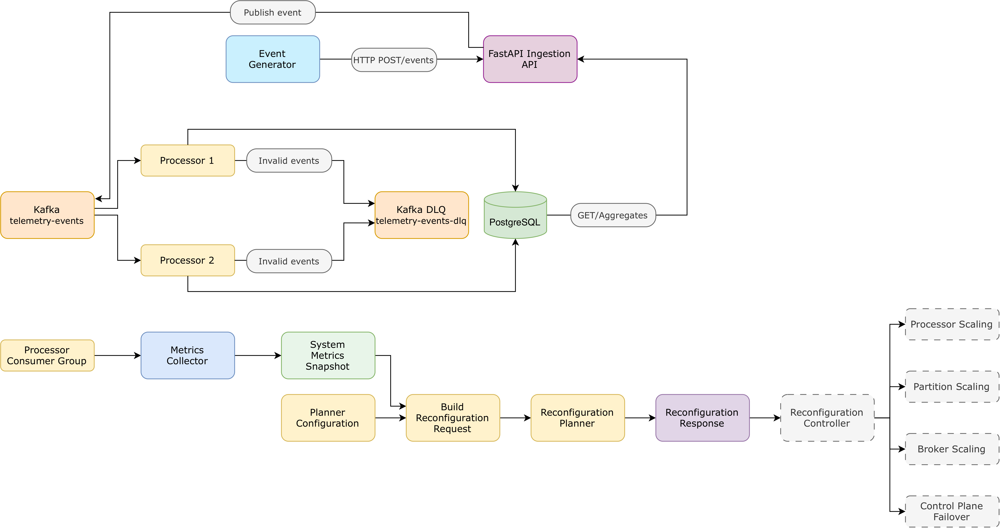
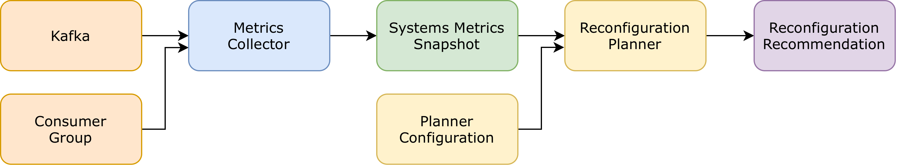

# Distributed Telemetry Engine

Distributed platform for ingesting, processing and aggregating telemetry events generated by multiple sources.

Events are received through a FastAPI service, published to Kafka and consumed in parallel by multiple Processor instances belonging to the same consumer group. Processors compute 1-minute temporal aggregates and persist the results in PostgreSQL. The system also includes duplicate-event protection, a dead-letter queue (DLQ), runtime metrics collection and a simple reconfiguration planner.

## Architecture

The main event-processing architecture is shown below:



A separate monitoring path collects Kafka and consumer-group metrics and provides them to the Reconfiguration Planner:



The planner only produces recommendations. Automatic infrastructure reconfiguration, including starting additional Processor containers, increasing Kafka partitions, adding brokers and control-plane failover, is designed but intentionally not implemented.

## Main features

- HTTP ingestion API implemented with FastAPI.
- Kafka topic `telemetry-events` with 4 partitions.
- Two Processor instances in the same Kafka consumer group (`adaptive-processors`).
- 1-minute aggregations grouped by `source_id`, `metric_name` and `window_start`.
- PostgreSQL persistence of `count`, `sum`, `minimum` and `maximum`; average is derived from sum/count.
- Idempotent event processing through the `processed_events` table.
- Manual Kafka offset commits only after successful database processing or successful DLQ forwarding.
- Dead-letter queue (`telemetry-events-dlq`) for invalid events.
- Runtime metrics: arrival rate, per-partition rate, consumer lag and active workers.
- Reconfiguration planner for worker scaling and hot-partition detection.
- Configurable event generator supporting uniform/skewed traffic and duplicate generation.
- Automated pytest suite with unit and integration tests.
- Final end-to-end and Processor-failure validation.

## Event format

Example telemetry event:

```json
{
  "event_id": "8f55e942-78c3-49ee-8f55-c72bf728a214",
  "source_id": "sensor-17",
  "event_time": "2026-08-01T10:15:22.521Z",
  "metric_name": "temperature",
  "value": 23.5,
  "schema_version": 1
}
```

`source_id` is used as the Kafka message key, so events from the same source are consistently routed according to Kafka partitioning.

## Processing and delivery semantics

Processor consumption follows **at-least-once** semantics. A Processor may therefore receive the same event more than once.

An exactly-once logical effect is obtained through idempotency:

1. the Processor attempts to insert `event_id` into `processed_events`;
2. `event_id` is a PostgreSQL primary key;
3. the aggregate is updated only when the event was not already present;
4. the PostgreSQL transaction is committed before the Kafka offset is committed.

If a Processor crashes after the database commit but before the Kafka offset commit, Kafka may redeliver the event, but the duplicate is detected and does not modify the aggregate again.

Events that cannot be validated by a Processor are forwarded to the `telemetry-events-dlq` topic. The original payload and key are preserved, while the original topic, partition and offset are stored as Kafka headers. The source offset is committed only after the DLQ publication succeeds.

## Running the project

Unless otherwise specified, all Docker commands in this README are intended to be executed from the host machine, in the project directory containing `compose.yaml`.

### Requirements

- Docker
- Docker Compose

From the project root:

```bash
docker compose up -d --build
```

The API is then available at:

<http://localhost:8000>

Useful commands:

```bash
# Show service status
docker compose ps

# Follow logs
docker compose logs -f

# Stop the environment
docker compose down
```

To also remove the PostgreSQL volume and start again from an empty database:

```bash
docker compose down -v
```

## API endpoints

| Method | Endpoint | Purpose |
|---|---|---|
| `POST` | `/events` | Validate and publish a telemetry event to Kafka |
| `GET` | `/aggregates` | Retrieve aggregates for a source/metric and time interval |
| `POST` | `/reconfiguration` | Run the planner with a manually supplied request |
| `GET` | `/metrics` | Collect the current runtime system metrics |
| `GET` | `/reconfiguration/auto` | Collect current metrics and automatically run the planner |
| `GET` | `/health` | Basic API health check |

Example aggregate query:

```text
GET /aggregates?source_id=sensor-1&metric_name=temperature&window_start=2026-09-12T10:00:00Z&window_end=2026-09-12T11:00:00Z
```

FastAPI also exposes its interactive API documentation at:

<http://localhost:8000/docs>

## Event Generator

The generator sends synthetic telemetry events through the HTTP API.

Example, executed from the host through the API container:

```bash
docker compose exec api python -m generator.main \
  --sources 10 \
  --rate 50 \
  --duration 30 \
  --duplicate-rate 0.05 \
  --distribution uniform
```

Available traffic distributions:

- `uniform`: sources are selected uniformly;
- `skewed`: one source generates most of the traffic, useful for hot-partition tests.

Supported telemetry metrics are `temperature`, `humidity` and `pressure`.

The generator also reports execution statistics such as the number of requests sent, accepted and failed requests, generated duplicates, achieved request rate, average latency and p95 latency.

## Reconfiguration Planner

The planner considers:

- overall `arrival_rate`;
- configured `worker_capacity`;
- configured `target_utilization`;
- number of active workers;
- consumer lag as an additional indication of processing pressure;
- per-partition arrival rates.

It can currently recommend:

- `SCALE_WORKERS` when additional processing capacity is required;
- `INVESTIGATE_HOT_PARTITION` when one partition receives an unusually high share of the traffic.

Worker recommendations are limited by the number of available Kafka partitions, since consumers in the same group cannot provide useful parallelism beyond the partition count.

## Testing

The project uses `pytest` for unit and integration testing.

The automated test suite covers:

- Pydantic models and validation;
- API endpoints;
- event generation;
- HTTP sender behaviour;
- Processor logic and windowing;
- PostgreSQL database and repository operations;
- duplicate-event handling;
- DLQ forwarding;
- metrics collection;
- reconfiguration request construction;
- Reconfiguration Planner behaviour.

With the Docker environment running, execute the complete automated suite from the host with:

```bash
docker compose exec api python -m pytest -v
```

Run only tests that do not require external services:

```bash
docker compose exec api python -m pytest -m "not integration" -v
```

Integration tests require the corresponding Kafka, PostgreSQL and Processor services to be running.

## Configuration

The main settings are provided through environment variables and Docker Compose defaults. Values defined in the local environment or `.env` file may override the Compose fallback values shown below.

| Variable | Purpose | Default / Compose fallback |
|---|---|---|
| `KAFKA_BOOTSTRAP_SERVERS` | Kafka connection | `kafka:19092` inside Docker |
| `KAFKA_TOPIC` | Main event topic | `telemetry-events` |
| `KAFKA_CONSUMER_GROUP` | Processor consumer group | `adaptive-processors` |
| `KAFKA_DLQ_TOPIC` | Dead-letter topic | `telemetry-events-dlq` |
| `POSTGRES_HOST` | PostgreSQL host | `postgres` inside Docker |
| `POSTGRES_PORT` | PostgreSQL port | `5432` |
| `POSTGRES_DB` | Database name | `adaptive_metrics` |
| `POSTGRES_USER` | Database user | `adaptive` |
| `POSTGRES_PASSWORD` | Database password | `adaptive_local_password` |
| `METRICS_SAMPLE_INTERVAL` | Metrics observation window | `5.0` seconds |
| `KAFKA_REQUEST_TIMEOUT` | Kafka metrics request timeout | `5.0` seconds |
| `WORKER_CAPACITY` | Planner capacity per worker | `100.0` events/s |
| `TARGET_UTILIZATION` | Planner target utilisation | `0.8` |
| `GENERATOR_API_URL` | Generator destination | `http://localhost:8000/events` |

Kafka is also exposed on `localhost:9092` for clients running directly on the host.

## Project structure

```text
.
├── common/                 # Shared Pydantic models
├── database/               # PostgreSQL schema and repository
├── generator/              # Synthetic event generator
├── metrics/                # Runtime metrics collector
├── processor/              # Kafka consumer, windowing and DLQ logic
├── services/               # Kafka producer and reconfiguration services
├── tests/                  # Unit and integration tests
├── main.py                 # FastAPI application
├── compose.yaml            # Complete local distributed environment
├── Dockerfile
├── pytest.ini
└── requirements.txt
```

## Current scope

Implemented:

- ingestion API;
- Kafka messaging and partitioned processing;
- multiple Processor instances;
- PostgreSQL persistence;
- deduplication and idempotent processing;
- 1-minute temporal aggregation;
- DLQ handling;
- runtime metrics collection;
- reconfiguration planning;
- Docker Compose environment;
- automated unit and integration tests;
- final end-to-end and Processor-failure validation.

Designed but not implemented:

- automatic startup of additional Processor containers;
- dynamic Kafka partition increases;
- automatic addition of Kafka brokers;
- control-plane failover and automated infrastructure reconciliation.